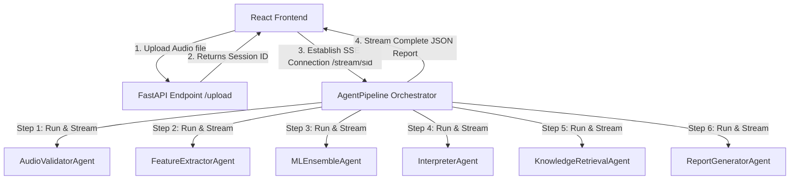

#Voice-Based Parkinson's Disease Screening System

Welcome! This study guide walks you through the entire architecture, machine learning pipeline, backend orchestrator, and frontend flow of your **Parkinson's Disease Voice Screening Application**. 

As a resume project, understanding the technical details of the ML training script, the agentic architecture, and the streaming API is critical for answering interview questions. Let's break it down step-by-step.

---

## 1. High-Level System Architecture

The project is split into a **Frontend (Vite + React)** and a **Backend (FastAPI)**. Instead of a single monolithic model running in a basic API, this system uses an **Agentic Pipeline Orchestrator** to execute 6 independent specialized steps in a flow, streaming live updates to the frontend using **Server-Sent Events (SSE)**.



---

## 2. Directory Structure

Here is how the project files are laid out:

```text
parkinsons-detection/
├── backend/
│   ├── main.py                     # Entry point for FastAPI application
│   ├── orchestrator.py             # Pipeline orchestrator that runs the 6 agents
│   ├── requirements.txt            # Python dependencies
│   ├── agents/                     # The 6 agents (derived from base class)
│   │   ├── base.py                 # Abstract Base Class and Result wrapper
│   │   ├── audio_validator.py      # Step 1: Validates audio duration, SNR, etc.
│   │   ├── feature_extractor.py    # Step 2: Extracts 22 voice biomarkers
│   │   ├── ml_ensemble.py          # Step 3: Runs inference on 7 ML models
│   │   ├── interpreter.py          # Step 4: Stratifies risk tier and z-scores
│   │   ├── knowledge_retrieval.py  # Step 5: Enriches report with medical articles
│   │   └── report_generator.py     # Step 6: Formats final diagnostic report
│   ├── models/                     # ML training script and trained pickle files
│   │   ├── train_and_save.py       # ML Pipeline training script
│   │   ├── scaler.pkl              # Pre-trained StandardScaler
│   │   ├── feature_stats.json      # Training set mean & std for z-score ranking
│   │   ├── model_metrics.json      # Accuracy, recall, and F1 scores of models
│   │   └── [model_name].pkl        # Pickled models (Logistic Regression, RF, XGB, etc.)
│   ├── data/
│   │   └── knowledge_base.json     # Local clinical database of Parkinson's details
│   └── routers/                    # FastAPI route definitions
│       ├── analysis.py             # Uploading, SSE streaming, and retrieving reports
│       ├── health.py               # API health check
│       └── knowledge.py            # Clinical knowledge retrieval
└── frontend/                       # Vite + React dashboard UI
```

---

## 3. The Machine Learning Phase ([train_and_save.py](file:///E:/parkinson/parkinsons-detection/backend/models/train_and_save.py))

Before the backend can analyze voice files, the ML models must be trained. This is handled by [train_and_save.py](file:///E:/parkinson/parkinsons-detection/backend/models/train_and_save.py).

### A. The Dataset
The project trains on the **UCI Parkinson's Dataset** (originally collected by Max Little). It consists of acoustic voice measurements from 31 people—23 diagnosed with Parkinson's Disease (PD) and 8 healthy controls. The participants sustained a vowel sound (`"aah"`) for a few seconds.

The dataset contains **22 features** (voice biomarkers) classified into five clinical categories:
1.  **Fundamental Frequency ($F_0$):** Average, maximum, and minimum vocal pitch (`MDVP:Fo`, `MDVP:Fhi`, `MDVP:Flo`).
2.  **Jitter:** Cycle-to-cycle frequency variations (micro-instability in vocal fold vibration).
3.  **Shimmer:** Cycle-to-cycle amplitude variations (vocal volume instability).
4.  **Harmonicity Ratios:** Noise-to-harmonics ratio (`NHR`) and Harmonics-to-noise ratio (`HNR`), indicating vocal breathiness or clarity.
5.  **Complexity Measures:** Non-linear dynamic measurements (`RPDE`, `DFA`, `spread1`, `spread2`, `D2`, `PPE`) that capture vocal frequency fluctuations.

### B. Preprocessing & Data Augmentation Pipeline
Because the UCI dataset is relatively small (195 rows) and imbalanced (75% Parkinson's, 25% Healthy), [train_and_save.py](file:///E:/parkinson/parkinsons-detection/backend/models/train_and_save.py) implements advanced techniques to prevent overfitting:

1.  **Train/Test Split:** Performs a stratified 80/20 train/test split to preserve the ratio of Healthy vs. Parkinson's classes in both sets.
2.  **Feature Statistics Extraction:** Computes the mean, standard deviation, min, and max of the *original training set* and saves them to `feature_stats.json`. This is used during inference to identify anomalous features.
3.  **Gaussian Augmentation (5× Multiplier):** Multiplies the training data by creating synthetic variations. For each sample, it adds random Gaussian noise:
    $$\sigma = 0.02 \times \text{Feature Standard Deviation}$$
4.  **SMOTE (Synthetic Minority Over-sampling Technique):** Synthesizes new samples of the minority class (Healthy) by interpolating between nearest neighbors to achieve a perfect 50/50 balance.
5.  **Standardization:** Fits a `StandardScaler` on the augmented, balanced dataset and exports it as `scaler.pkl` to scale feature values during live API runs.

### C. Calibrated Model Ensemble
Instead of relying on a single algorithm, the pipeline trains **7 diverse classifiers**:
*   **Logistic Regression** (Linear baseline)
*   **K-Nearest Neighbors (KNN)** (Instance-based)
*   **Support Vector Machine (SVM)** (Boundary-based)
*   **Decision Tree** (Rule-based)
*   **Random Forest** (Bagging ensemble)
*   **Gradient Boosting** (Boosting ensemble)
*   **XGBoost** (Advanced gradient boosting)

> [!IMPORTANT]
> **Probability Calibration:** Raw ML outputs represent distance-to-boundaries rather than actual probability percentages. The script wraps every model in `CalibratedClassifierCV` using **Platt scaling (sigmoid method)**. This calibrates output probabilities so that a model predicting `0.87` means a genuine **87% confidence** of Parkinson's Disease.

---

## 4. The 6-Step Agent Pipeline ([orchestrator.py](file:///E:/parkinson/parkinsons-detection/backend/orchestrator.py))

When a user records their voice on the frontend, the file is uploaded, and the backend runs the [AgentPipeline](file:///E:/parkinson/parkinsons-detection/backend/orchestrator.py#L109). The pipeline consists of 6 agents, each extending `BaseAgent` from [base.py](file:///E:/parkinson/parkinsons-detection/backend/agents/base.py):

```python
class BaseAgent(ABC):
    def run(self, context: Dict[str, Any]) -> AgentResult:
        # Measures time taken, catches exceptions, calls execute()
```

Every agent modifies and appends to a shared `context` dictionary. Here is what each agent does:

### Step 1: Audio Validator ([audio_validator.py](file:///E:/parkinson/parkinsons-detection/backend/agents/audio_validator.py))
Before doing complex math, we must verify the audio quality. The validator uses the `librosa` library to load the audio and executes the following gates:
*   **Duration Gate:** Confirms if the recording is $\ge 2.0$ seconds.
*   **Sample Rate Gate:** Downsamples/upsamples to a baseline of 16,000 Hz if necessary.
*   **SNR Estimate:** Evaluates the Signal-to-Noise Ratio. It extracts the root mean square (RMS) energy of the quietest frames (noise floor) and compares it with the signal's overall RMS. The threshold is $\ge 10$ dB.
*   **Clipping Detection:** Checks if microphone gain is too high. If $>0.5\%$ of samples hit the maximum amplitude of `0.99`, it reports clipping.
*   **Silence Ratio:** Checks if the user stopped making sound. If $>60\%$ of the frames are below $10\%$ of the overall RMS, validation fails.

*Result:* If validation fails, the pipeline aborts early, returning a `quality_failed` event to prompt the user to re-record in a quieter environment.

### Step 2: Feature Extractor ([feature_extractor.py](file:///E:/parkinson/parkinsons-detection/backend/agents/feature_extractor.py))
This agent processes the validated audio array to extract the **22 acoustic biomarkers** matching the training set columns. It performs digital signal processing (DSP) calculations:
*   **Fundamental Frequency ($F_0$):** Extracted using the **pYIN algorithm** (`librosa.pyin`), which tracks vocal fold pitch periods.
*   **Jitter:** Compares consecutive period lengths ($\text{period} = 1 / f_0$). For example, absolute Jitter is calculated as:
    $$\text{Jitter(Abs)} = \frac{1}{N-1}\sum_{i=1}^{N-1}|T_i - T_{i+1}|$$
*   **Shimmer:** Computes frame amplitude variations over short sliding windows.
*   **HNR/NHR:** Decomposes the signal into harmonic and noise components using `librosa.effects.harmonic`, comparing their relative power.
*   **PPE & Non-linear Metrics:** Pitch Period Entropy (PPE) is computed by calculating entropy over a normalized 20-bin histogram of the voiced pitch values.
*   **Scaling:** Once raw features are extracted, they are scaled using the pre-trained `scaler.pkl` to produce `features_scaled`.

### Step 3: ML Ensemble ([ml_ensemble.py](file:///E:/parkinson/parkinsons-detection/backend/agents/ml_ensemble.py))
This agent loads the 7 model pickle files. To optimize memory and performance, the models are **lazy-loaded** and cached at the module level:

```python
_MODEL_CACHE = {}
def _get_models():
    global _MODEL_CACHE
    if not _MODEL_CACHE:
        # Load and populate pickle files
    return _MODEL_CACHE
```

*   **Inference:** Computes predictions (0 = Healthy, 1 = Parkinson's) and calibrated probabilities for all 7 models.
*   **Primary Model:** The Random Forest prediction and probability are designated as primary.
*   **Ensemble Vote:** Takes a majority vote across all 7 predictions.
*   **Ensemble Probability:** Takes the mean probability across all 7 classifiers.

### Step 4: Clinical Interpreter ([interpreter.py](file:///E:/parkinson/parkinsons-detection/backend/agents/interpreter.py))
Translates raw machine learning numbers into human-understandable clinical metrics:
*   **Combined Probability:** Takes a weighted average: $60\%$ primary model probability + $40\%$ ensemble average probability.
*   **Risk Tiers:** Categorizes the combined probability:
    *   **Low Risk:** $< 30\%$
    *   **Moderate Risk:** $30\% - 59.9\%$
    *   **High Risk:** $60\% - 84.9\%$
    *   **Critical Risk:** $\ge 85\%$
*   **Anomalous Feature Identification:** Compares the raw features of the patient against the baseline stats (`feature_stats.json`) using Z-scores:
    $$Z = \frac{\text{Patient Value} - \text{Training Mean}}{\text{Training Std}}$$
    It sorts the features by absolute Z-score, identifies the top 5 most anomalous biomarkers, and records whether they are "above" or "below" the training average.

### Step 5: Knowledge Retrieval ([knowledge_retrieval.py](file:///E:/parkinson/parkinsons-detection/backend/agents/knowledge_retrieval.py))
This agent acts as a semantic link between the ML findings and clinical education. It accesses `knowledge_base.json` (a structured database of clinical definitions, next steps, and lifestyle tips) to extract:
*   An explanation of Parkinson's Disease and acoustic indicators.
*   Specific clinical definitions and normal ranges for the patient's top 5 anomalous features.
*   Actionable next steps (e.g., "Schedule an appointment with a neurologist") tailored to the patient's specific risk tier.

### Step 6: Report Generator ([report_generator.py](file:///E:/parkinson/parkinsons-detection/backend/agents/report_generator.py))
Aggregates all results, formatting the diagnostic verdict, timestamp, validator outcomes, raw features, model results, and knowledge base details into a standardized, clean JSON object.

---

## 5. Web API & Streaming Protocol ([analysis.py](file:///E:/parkinson/parkinsons-detection/backend/routers/analysis.py))

FastAPI serves as the backend framework. Because extracting audio features and running 7 models takes a couple of seconds, the backend doesn't make the user wait on a frozen HTTP POST request. Instead, it uses **Server-Sent Events (SSE)**.

### How the SSE Workflow Works:
1.  **File Upload (`POST /api/v1/analysis/upload`):** 
    The client uploads the recorded file. FastAPI saves it temporarily in the OS temp directory, generates a unique UUID `session_id`, stores it in a global dictionary, and returns the ID immediately.
2.  **Streaming Pipeline (`GET /api/v1/analysis/stream/{session_id}`):**
    The client opens an Event Source connection to this endpoint. The endpoint instantiates the `AgentPipeline` and runs it as an async generator:
    ```python
    @router.get("/stream/{session_id}")
    async def stream_analysis(session_id: str):
        # ...
        async def event_generator():
            pipeline = AgentPipeline(session_id, audio_path)
            async for event_str in pipeline.run_stream():
                yield {"data": event_str}
        return EventSourceResponse(event_generator())
    ```
    Every time an agent starts or finishes, the pipeline yields an SSE event:
    *   `agent_start`: Notifies the frontend which step is beginning.
    *   `agent_done`: Transmits the intermediate output data from that step.
    *   `pipeline_complete`: Sends the final complete JSON report.

---

## 6. React Frontend Architecture

The frontend is a Vite + React application styled with responsive modern CSS.
Key components include:
*   [AudioUploader.jsx](file:///E:/parkinson/parkinsons-detection/frontend/src/components/AudioUploader.jsx): Provides voice recording via the HTML5 `MediaRecorder` API (recording in mono WAV/WebM format) and manages file upload state.
*   [PipelineTracker.jsx](file:///E:/parkinson/parkinsons-detection/frontend/src/components/PipelineTracker.jsx): Listens to the `/stream/{session_id}` SSE endpoint and displays a real-time progress stepper (validating -> extracting -> ensemble inference -> interpreting -> generating).
*   [ConfidenceGauge.jsx](file:///E:/parkinson/parkinsons-detection/frontend/src/components/ConfidenceGauge.jsx): Renders an interactive radial gauge showing the combined probability risk score.
*   [FeatureChart.jsx](file:///E:/parkinson/parkinsons-detection/frontend/src/components/FeatureChart.jsx): Renders a visualization chart showcasing the patient's anomalous voice biomarkers.
*   [ModelTable.jsx](file:///E:/parkinson/parkinsons-detection/frontend/src/components/ModelTable.jsx): Displays a breakdown of predictions and probabilities from all 7 models.
*   [ReportCard.jsx](file:///E:/parkinson/parkinsons-detection/frontend/src/components/ReportCard.jsx) & [KnowledgePanel.jsx](file:///E:/parkinson/parkinsons-detection/frontend/src/components/KnowledgePanel.jsx): Summarizes the diagnostic verdict, next steps, and explanations of clinical biomarkers.

---

## 7. Key Python & Architectural Concepts (For Interviews)

If an interviewer asks how you built this, highlight these advanced features:

| Feature / Concept | How it's used in the project | Why it matters |
| :--- | :--- | :--- |
| **Calibrated Probabilities** | `CalibratedClassifierCV(method='sigmoid')` | Transforms arbitrary classifier scores into actual, statistically valid clinical risk percentages. |
| **Data Augmentation & SMOTE** | Gaussian Perturbation ($5\times$) + SMOTE | Prevents overfitting on a small dataset (195 rows) and fixes class imbalance (75% positive). |
| **Server-Sent Events (SSE)** | `EventSourceResponse` in FastAPI | Streams execution state step-by-step to the UI, providing a responsive UX instead of blocking HTTP calls. |
| **Async Generators & Executors** | `async for` & `loop.run_in_executor` | Runs heavy CPU-bound ML tasks (inference, DSP extraction) in thread pools without blocking the main event loop. |
| **Abstract Base Classes (ABC)** | `BaseAgent` in `agents/base.py` | Enforces a consistent interface across all pipeline agents, simplifying error handling and logging. |
| **Z-Score Normalization** | Calculating Z-scores of features using training stats | Quantifies exactly how much and in what direction the patient's voice biomarkers deviate from the baseline population. |
| **Lazy Loading & Caching** | Module-level cached dict for the 7 models | Prevents re-loading heavy `.pkl` model files on every API request, reducing response times. |

---

> [!NOTE]
> **Resume Bullet Point Suggestion:**
> *"Engineered an agentic machine learning pipeline using FastAPI and React to detect Parkinson's Disease indicators via voice biomarkers. Implemented a 7-model ensemble with Platt probability calibration, synthetic data augmentation (SMOTE & Gaussian noise), and real-time step-by-step progress tracking via Server-Sent Events (SSE)."*

## Run it
```bash
pip install ucimlrepo xgboost scikit-learn
```
Then open the notebook — dataset loads automatically.
